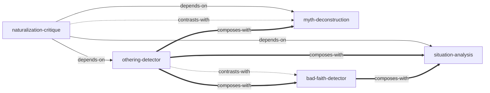

# 第二性 — Skill Index

## 关于这本书

- **作者**: 西蒙·德·波娃 (Simone de Beauvoir)
- **出版年**: 1949
- **一句话主旨**: 女人不是天生的，而是被塑造成的——女性作为"他者"的处境是历史建构的，而非生物决定的，因此可以被改变
- **整书理解**: 见 [BOOK_OVERVIEW.md](./BOOK_OVERVIEW.md)

---

## Skill 列表 (按主题分组)

### 权力结构分析

- [`othering-detector`](./othering-detector/SKILL.md) — 识别群体被"他者化"的结构化框架
- [`naturalization-critique`](./naturalization-critique/SKILL.md) — 拆解"这是自然的"论证的三步法

### 个体与处境

- [`bad-faith-detector`](./bad-faith-detector/SKILL.md) — 识别"逃避自由、接受他人赋予角色"的自欺模式
- [`situation-analysis`](./situation-analysis/SKILL.md) — 系统分析个人多维度处境的工具

### 文化批判

- [`myth-deconstruction`](./myth-deconstruction/SKILL.md) — 解构文化神话的运作机制

---

## 引用图

图例:
- `-->`  depends-on
- `-.->` contrasts-with
- `===>` composes-with

---

## 推荐学习顺序

1. **naturalization-critique** — 最基础，无前置；学会拆解"自然"的伪装
2. **othering-detector** — 依赖自然化批判；识别"谁定义谁"的权力结构
3. **myth-deconstruction** — 依赖自然化批判；解构文化叙事的运作
4. **bad-faith-detector** — 依赖他者化识别；理解被压迫者的内化
5. **situation-analysis** — 依赖自然化批判；综合分析多维度处境

---

