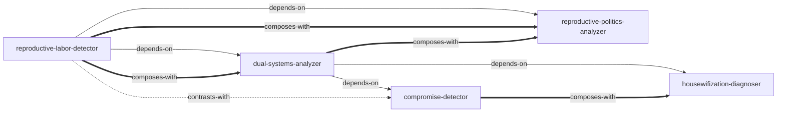

# 父权制与资本主义 — Skill Index

## 关于这本书

- **作者**: 上野千鹤子
- **出版年**: 1990（日文版）
- **一句话主旨**: 父权制与资本主义是两个相互关联又相对独立的压迫体系，女性在家庭中承担的无偿再生产劳动是连接这两个体系的关键节点
- **整书理解**: 见 [BOOK_OVERVIEW.md](./BOOK_OVERVIEW.md)

---

## Skill 列表 (按分析层次分组)

### 基础识别

- [`reproductive-labor-detector`](./reproductive-labor-detector/SKILL.md) — 识别被"自然化""以爱之名"掩盖的无偿再生产劳动

### 体系分析

- [`dual-systems-analyzer`](./dual-systems-analyzer/SKILL.md) — 同时分析父权制和资本主义两个体系及其交互作用
- [`compromise-detector`](./compromise-detector/SKILL.md) — 识别父权制与资本主义在不同历史阶段的妥协形式

### 诊断与政治

- [`housewifization-diagnoser`](./housewifization-diagnoser/SKILL.md) — 诊断劳动力的"家庭主妇化"边缘化过程
- [`reproductive-politics-analyzer`](./reproductive-politics-analyzer/SKILL.md) — 分析再生产决策的政治性

---

## 引用图

---

## 推荐学习顺序

1. **reproductive-labor-detector** — 最基础，学会识别被隐形化的劳动
2. **dual-systems-analyzer** — 理解两个体系的交互作用
3. **compromise-detector** — 识别妥协形式，理解"变化≠进步"
4. **housewifization-diagnoser** — 诊断当代劳动市场的边缘化
5. **reproductive-politics-analyzer** — 分析再生产决策的政治性

---
