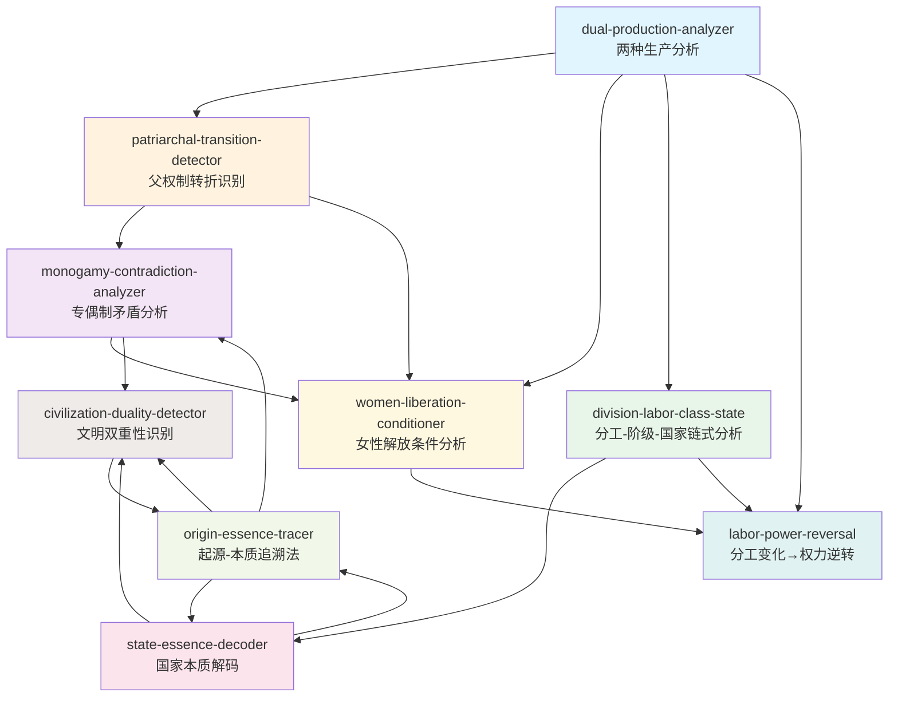

# 《家庭、私有制和国家的起源》— Skill 索引

## Skill 总览

| # | Skill 名称 | 核心功能 | 来源章节 |
|---|-----------|---------|---------|
| 1 | dual-production-analyzer | 两种生产分析框架 | 第一版序言/第二章/第九章 |
| 2 | patriarchal-transition-detector | 父权制转折识别 | 第二章/第九章 |
| 3 | division-labor-class-state | 分工-阶级-国家链式分析 | 第九章 |
| 4 | state-essence-decoder | 国家本质解码 | 第九章/第五章/第六章 |
| 5 | monogamy-contradiction-analyzer | 专偶制矛盾分析 | 第二章 |
| 6 | women-liberation-conditioner | 女性解放条件分析 | 第二章/第九章 |
| 7 | civilization-duality-detector | 文明双重性识别 | 第九章/第二章 |
| 8 | labor-power-reversal | 分工变化→权力逆转 | 第二章/第九章 |
| 9 | origin-essence-tracer | 起源-本质追溯法 | 全书 |

---

## 引用关系图

---

## 依赖关系详解

### 1. dual-production-analyzer（根节点）
- **被依赖**: patriarchal-transition-detector, women-liberation-conditioner, division-labor-class-state, labor-power-reversal
- **说明**: "两种生产"是全书的方法论基础，所有后续分析都建立在此之上

### 2. patriarchal-transition-detector
- **依赖**: dual-production-analyzer
- **被依赖**: monogamy-contradiction-analyzer, women-liberation-conditioner
- **说明**: 父权制转折是两种生产关系失衡的具体表现

### 3. division-labor-class-state
- **依赖**: dual-production-analyzer
- **被依赖**: state-essence-decoder, labor-power-reversal
- **说明**: 分工-阶级-国家链是"生活资料生产"维度的展开

### 4. state-essence-decoder
- **依赖**: division-labor-class-state
- **被依赖**: civilization-duality-detector, origin-essence-tracer
- **说明**: 国家的本质是阶级统治的工具——这是分工-阶级-国家链的终点

### 5. monogamy-contradiction-analyzer
- **依赖**: patriarchal-transition-detector
- **被依赖**: women-liberation-conditioner, civilization-duality-detector
- **说明**: 专偶制的矛盾是父权制转折的具体表现

### 6. women-liberation-conditioner
- **依赖**: dual-production-analyzer, patriarchal-transition-detector, monogamy-contradiction-analyzer, labor-power-reversal
- **被依赖**: (无)
- **说明**: 女性解放条件是全书分析的实践指向——综合了所有前置分析

### 7. civilization-duality-detector
- **依赖**: state-essence-decoder, monogamy-contradiction-analyzer
- **被依赖**: origin-essence-tracer
- **说明**: 文明的双重性是国家和专偶制矛盾的综合

### 8. labor-power-reversal
- **依赖**: dual-production-analyzer
- **被依赖**: women-liberation-conditioner, patriarchal-transition-detector
- **说明**: 分工变化→权力逆转是两种生产关系变化的具体机制

### 9. origin-essence-tracer（方法论节点）
- **依赖**: (无前置——是通用方法论)
- **被依赖**: state-essence-decoder, monogamy-contradiction-analyzer, civilization-duality-detector
- **说明**: 起源-本质追溯法是贯穿全书的方法论，可以独立使用

---

## 使用路径

### 路径A：分析性别不平等的经济起源
1. dual-production-analyzer → patriarchal-transition-detector → monogamy-contradiction-analyzer → women-liberation-conditioner

### 路径B：分析国家的阶级本质
1. dual-production-analyzer → division-labor-class-state → state-essence-decoder → civilization-duality-detector

### 路径C：分析劳动贬值的机制
1. dual-production-analyzer → labor-power-reversal → women-liberation-conditioner

### 路径D：批判"自然化"话语
1. origin-essence-tracer → state-essence-decoder / monogamy-contradiction-analyzer / civilization-duality-detector
