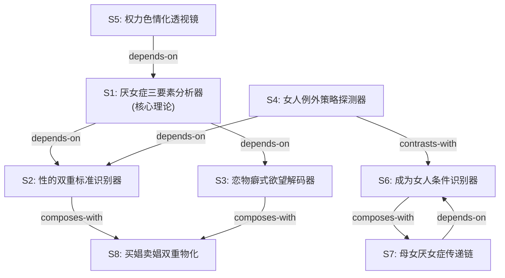

# 厌女：日本的女性嫌恶 — Skill 索引

> 上野千鹤子 | 2010 | 厌女症不是个别男人的心理问题，而是深植于性别二元秩序核心的系统性机制——男人表现为"女性蔑视"，女人表现为"自我厌恶"，无人能逃。

---

## Skill 列表（按主题分组）

### 🔴 核心理论

| # | Skill | 一句话 | 文件 |
|---|---|---|---|
| S1 | 厌女症三要素分析器 | 男性同性社会性欲望+同性恋憎恶+厌女症三位一体，构成性别秩序 | [S1-misogyny-triad-analyzer.md](candidates/S1-misogyny-triad-analyzer.md) |
| S5 | 权力色情化透视镜 | 性支配与权力支配同构，暴力→权力→财力构成等级序列 | [S5-power-eroticization-lens.md](candidates/S5-power-eroticization-lens.md) |

### 🟡 运作机制

| # | Skill | 一句话 | 文件 |
|---|---|---|---|
| S2 | 性的双重标准识别器 | "圣女/娼妓"分割策略，分而治之 | [S2-sexual-double-standard-detector.md](candidates/S2-sexual-double-standard-detector.md) |
| S3 | 恋物癖式欲望解码器 | 男人对"女性符号"而非具体女人发情 | [S3-fetishistic-desire-decoder.md](candidates/S3-fetishistic-desire-decoder.md) |
| S8 | 买娼卖娼双重物化分析器 | 买娼使男人憎恶女人，卖娼让女人轻蔑男人 | [S8-prostitution-double-objectification-analyzer.md](candidates/S8-prostitution-double-objectification-analyzer.md) |

### 🟢 女人的厌女症

| # | Skill | 一句话 | 文件 |
|---|---|---|---|
| S4 | 女人例外策略探测器 | "往上走"或"往下退"——例外策略不改变歧视机制 | [S4-female-exception-strategy-detector.md](candidates/S4-female-exception-strategy-detector.md) |
| S6 | "成为女人"条件识别器 | 女性身份由"被凝视"外部赋予 | [S6-becoming-woman-condition-identifier.md](candidates/S6-becoming-woman-condition-identifier.md) |
| S7 | 母女厌女症传递链分析器 | 母亲将"被估价"逻辑传递给女儿 | [S7-mother-daughter-misogyny-chain-analyzer.md](candidates/S7-mother-daughter-misogyny-chain-analyzer.md) |

---

## 引用图



---

## 关系说明

| 关系 | 类型 | 说明 |
|---|---|---|
| S1 → S2 | depends-on | 理解三要素结构后，才能理解"分割支配"是厌女症的具体策略 |
| S1 → S3 | depends-on | 理解三要素结构后，才能理解"恋物癖式欲望"是厌女症的欲望机制 |
| S2 ↔ S8 | composes-with | 双重标准是买娼卖娼的前提条件，两者经常配合分析 |
| S3 ↔ S8 | composes-with | 恋物癖式欲望是性产业的运作逻辑，两者经常配合分析 |
| S5 → S1 | depends-on | 权力色情化以三要素结构为基础，理解权力与性的同构需要先理解性别秩序 |
| S4 → S2 | depends-on | 例外策略是对双重标准的回应——女人在"圣女/娼妓"分割中寻找"例外" |
| S6 ↔ S7 | composes-with | "成为女人"的条件是母女传递链的核心内容，两者经常配合分析 |
| S4 ↔ S6 | contrasts-with | 例外策略是"如何逃避自我厌恶"，成为女人条件是"自我厌恶如何形成"——一个应对，一个溯源 |
| S7 → S6 | depends-on | 理解"成为女人"的条件后，才能理解母亲如何将这个条件传递给女儿 |

---

## 推荐学习顺序

```
第一层（入门）: S1 → S2 → S3
  先理解核心理论框架，再学两个最基本的运作机制

第二层（深化）: S5 → S4
  理解权力与性的同构，再看女人如何应对自我厌恶

第三层（具体）: S6 → S7 → S8
  从身份形成到代际传递，最后到性买卖中的极端物化
```

**最快路径**（只学3个）: S1 → S2 → S4
**完整路径**（全部8个）: S1 → S2 → S3 → S5 → S4 → S6 → S7 → S8
